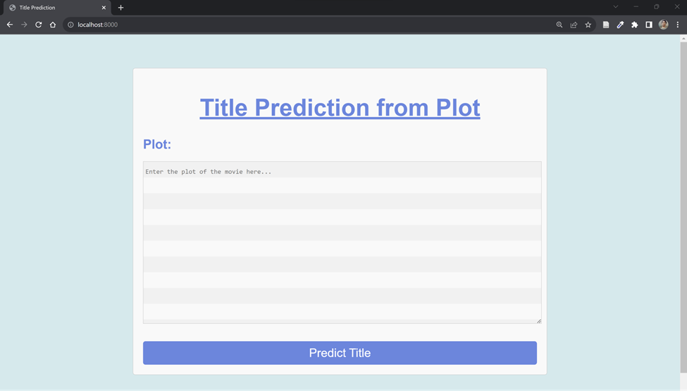
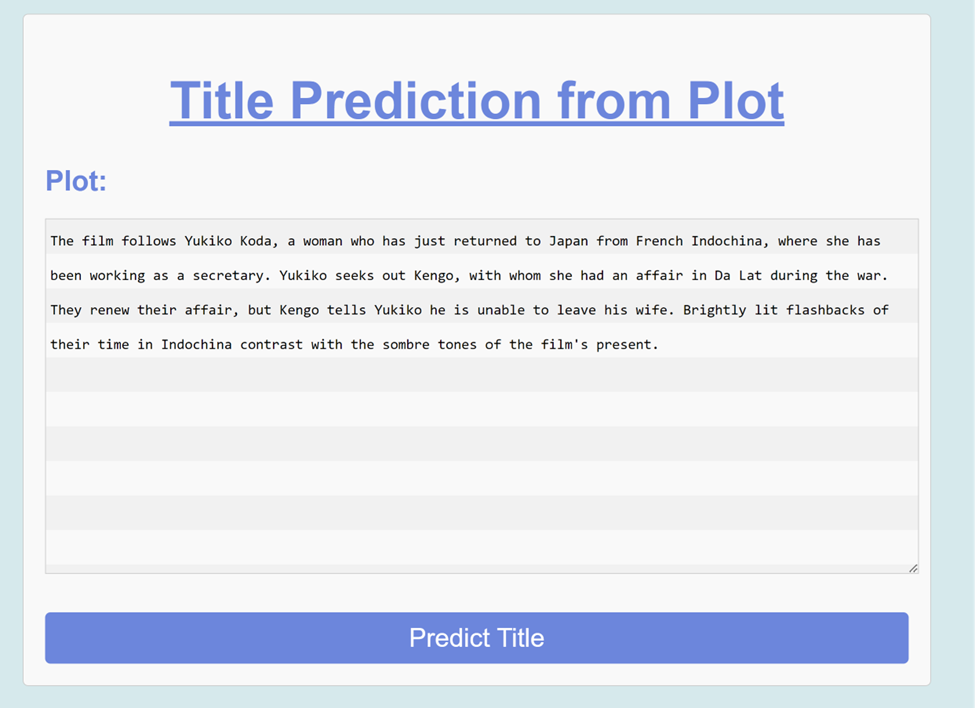

# Web Interface:
1. Asking input from the User 

2. Entering the user input.

3. Top 10 Predictions on display.

# Instructions to run the Website:

1. extract all the code into a directory.
2. Navigate to the directory from the terminal.
3. Create a virtual environment by running: python -m venv venv
4. Activate the environment by running: venv\Scripts\activate.bat
5. pip install the requirements using: pip install -r requirements.txt
6. Navigate to title_from_plot directory and run: python manage.py runserver
7. Go to localhost:8080 to see the website running.